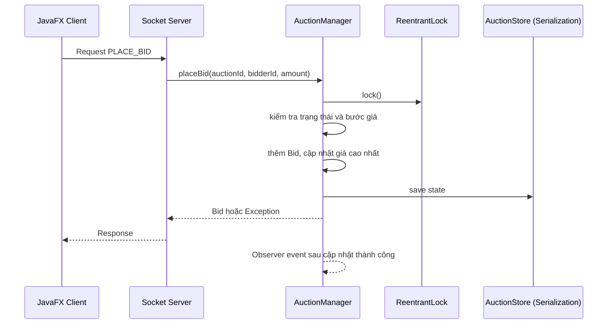
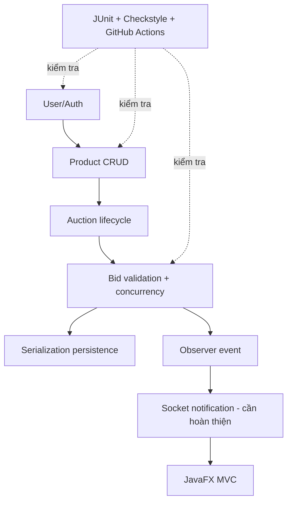

# Sơ đồ luồng
## Luồng đặt giá

```mermaid
sequenceDiagram
 participant C as JavaFX Client
 participant S as Socket Server
 participant M as AuctionManager
 participant L as ReentrantLock
 participant D as AuctionStore (Serialization)
 C->>S: Request PLACE_BID
 S->>M: placeBid(auctionId, bidderId, amount)
 M->>L: lock()
 M->>M: kiểm tra trạng thái và bước giá
 M->>M: thêm Bid, cập nhật giá cao nhất
 M->>D: save state
 M-->>S: Bid hoặc Exception
 S-->>C: Response
 M-->>M: Observer event sau cập nhật thành công
```
## Quan hệ luồng

```mermaid
flowchart TD
 U[User/Auth] --> P[Product CRUD]
 P --> A[Auction lifecycle]
 A --> B[Bid validation + concurrency]
 B --> D[Serialization persistence]
 B --> O[Observer event]
 O --> N[Socket notification - cần hoàn thiện]
 N --> UI[JavaFX MVC]
 T[JUnit + Checkstyle + GitHub Actions] -. kiểm tra .-> U
 T -. kiểm tra .-> P
 T -. kiểm tra .-> B
```
Lưu ý: starter minh họa request/response Socket; broadcast realtime đến tất cả client cần được hoàn thiện bằng registry kết nối + Observer.
